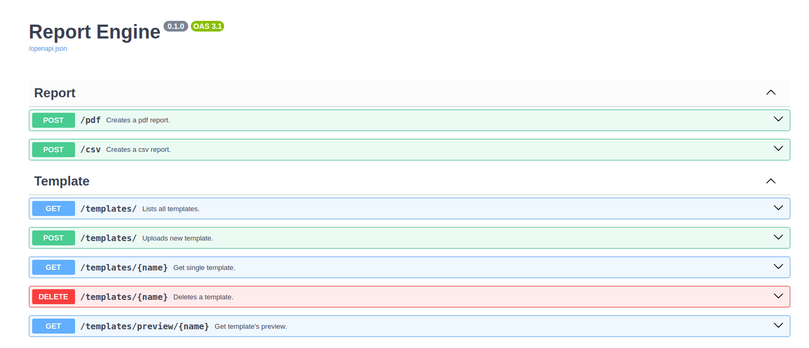

# FastAPI Report Engine

Reporting service that allows you to obtain customized PDF and CSV reports using .docx extension report templates created in [Jinja2](https://palletsprojects.com/p/jinja/) format.

## Usage
You can start using the current deb package by installing it on Ubuntu 20.x and 22.x systems via the [link](https://github.com/limanmys/fastapi-report-engine/releases/latest) . It works on the system under the service name `report-engine.service` and over port `8001`.

```bash
sudo apt install ./report-engine-47.deb
# to show service logs
sudo journalctl -u report-engine.service -f
```

## Documentation
While the service is running properly, Swagger documentation can be accessed at [localhost:8001/docs](localhost:8001/docs).

